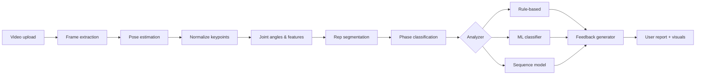

# Architecture

## Pipeline overview

## Module responsibilities

### `backend/data`
Load videos with OpenCV, extract frames at target FPS, resize, and persist frames or metadata. Handles train/val splits and label files.

### `backend/pose`
Wrap MediaPipe Pose (or YOLO Pose). Output per-frame keypoints (x, y, visibility) as JSON/CSV.

### `backend/features`
Compute geometry: hip, knee, ankle, torso angles; shoulder–hip alignment; velocity and smoothness. Normalize by torso length for camera invariance.

### `backend/ml`
- Baseline: sklearn classifiers on aggregated rep features
- Deep (planned): LSTM / Temporal CNN / Transformer on `(batch, seq_len, n_features)` tensors

### `backend/training`
Training loops, loss functions, optimizers, early stopping, checkpointing, evaluation metrics.

### `backend/inference`
Orchestrates the full pipeline on a single video path and returns structured results.

### `backend/feedback`
Maps detected mistakes to templated coaching messages. LLM integration stays optional and separate.

### `backend/visualization`
Skeleton overlays, angle plots, rep markers on timeline.

### `backend/utils`
Config parsing (`configs/default.yaml`), logging, angle math, file I/O helpers.

## Tensor shapes (Phase 8 preview)

| Tensor | Shape | Description |
|--------|-------|-------------|
| Input sequence | `(B, T, F)` | Batch, time steps (frames per rep), feature dim |
| LSTM hidden | `(B, H)` | Pooled representation |
| Output logits | `(B, C)` | C = mistake classes or quality score |

## Separation of concerns

- **Detection logic** (rules + models) lives in `backend/features`, `backend/ml`, `backend/inference`
- **Natural language** lives in `backend/feedback` — swappable templates or LLM without changing core models
